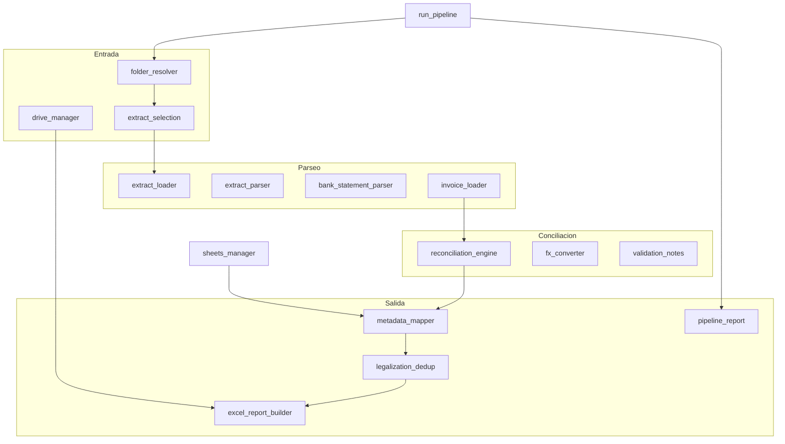

# Mapa de módulos — Legalización TC

Este documento describe **qué hace cada archivo Python** del repositorio, **en qué orden intervienen** en el pipeline y **dónde profundizar**. La lógica detallada vive en los docstrings del código fuente.

El proyecto automatiza la **legalización mensual de tarjetas de crédito corporativas**: cruza movimientos bancarios con facturas, aplica reglas contables (IVA, GMF, moneda extranjera) y genera el Excel de legalización en Google Drive.

**División de responsabilidades:**

| Componente | Rol |
|------------|-----|
| **Python** (`src/legalizacion_tc/`) | Extracto, conciliación, FX, Excel, Drive, Sheets |
| **Claude Code** (operador) | Lee PDFs de facturas en sesión → JSON en `.cache/cards/{tarjeta}/invoices/` |

## Documentación relacionada

| Documento | Uso |
|-----------|-----|
| [README.md](../README.md) | Instalación y quick start |
| [AGENTS.md](../AGENTS.md) | Contrato del operador Claude Code |
| [docs/PROMPT-FACTURAS.md](PROMPT-FACTURAS.md) | Prompt de extracción de facturas |
| **docs/MODULOS.md** (este) | Mapa del código |

---

## Flujo del pipeline



**Orden típico por tarjeta** (orquestado por `run_pipeline`):

1. Resolver subcarpetas → elegir extracto (PDF > Excel)
2. Validar JSON de facturas en caché
3. Conciliar movimientos y deduplicar contra Formatos previos
4. Mapear a filas Excel, generar/merge workbook, subir a Drive
5. Actualizar columnas Validación/Observaciones del preliminar (solo si origen es Excel)
6. Emitir reporte JSON en stdout

---

## Módulos del paquete (`src/legalizacion_tc/`)

### Capa 1 — Configuración y dominio

| Módulo | Responsabilidad | Entradas / salidas | APIs clave |
|--------|-----------------|-------------------|------------|
| [config.py](../src/legalizacion_tc/config.py) | Configuración central: rutas de caché y parámetros de negocio (tolerancias, IVA, keywords restaurante). Lee `.env`. | `.env` → `Settings` | `load_settings`, `Settings`, `invoices_cache_dir`, `output_cache_dir` |
| [models.py](../src/legalizacion_tc/models.py) | Modelos de dominio compartidos por todo el pipeline. | Dataclasses entre etapas | `Transaction`, `ExtractData`, `InvoiceData`, `MatchResult`, `LegalizationRow`, `PipelineResult` |
| [google_auth.py](../src/legalizacion_tc/google_auth.py) | Autenticación Google API vía Application Default Credentials (cuenta de servicio). | Env `GOOGLE_APPLICATION_CREDENTIALS` | `drive_service`, `sheets_service` |

---

### Capa 2 — Entrada y resolución de carpetas

| Módulo | Responsabilidad | Entradas / salidas | APIs clave |
|--------|-----------------|-------------------|------------|
| [folder_resolver.py](../src/legalizacion_tc/folder_resolver.py) | Resuelve carpeta Drive/local en contextos por tarjeta (`1111 - Demo User A`). | URL o path → `list[CardFolderContext]` | `resolve_card_folders`, `CardFolderContext` |
| [drive_manager.py](../src/legalizacion_tc/drive_manager.py) | I/O con Google Drive y clasificación de archivos (extracto, facturas, Formatos). | Drive API / paths locales | `list_invoice_files`, `download_to_cache`, `upload_file`, `find_base_legalization_file` |
| [extract_selection.py](../src/legalizacion_tc/extract_selection.py) | Selección del mejor archivo de movimientos. **PDF priorizado sobre Excel.** | `list[DriveFile]` → `ExtractSelection` | `select_best_extract_file` |
| [extract_loader.py](../src/legalizacion_tc/extract_loader.py) | Enruta al parser correcto según extensión (`.pdf` o `.xlsx`). | Path → `LoadedExtract` | `parse_movement_source` |
| [extract_parser.py](../src/legalizacion_tc/extract_parser.py) | Parser del preliminar Excel `Mov TC*.xlsx` → `ExtractData`. | Excel → movimientos + GMF | `parse_extract`, `is_gmf_description` |
| [bank_statement_parser.py](../src/legalizacion_tc/bank_statement_parser.py) | Parser del extracto PDF Bancolombia → `ExtractData`. | PDF → movimientos + GMF | `parse_bancolombia_statement` |
| [invoice_loader.py](../src/legalizacion_tc/invoice_loader.py) | Carga y validación de JSON de facturas en `.cache/cards/{tarjeta}/invoices/`. | JSON → `InvoiceData` | `load_invoices_from_cache`, `missing_invoice_json`, `incomplete_invoice_json` |

---

### Capa 3 — Conciliación

| Módulo | Responsabilidad | Entradas / salidas | APIs clave |
|--------|-----------------|-------------------|------------|
| [reconciliation_engine.py](../src/legalizacion_tc/reconciliation_engine.py) | Motor de conciliación: enlaza movimientos del extracto con facturas JSON. | `ExtractData` + facturas → `list[MatchResult]` | `reconcile` |
| [fx_converter.py](../src/legalizacion_tc/fx_converter.py) | Conversión moneda extranjera → COP vía API Frankfurter (fecha del movimiento). | monto + moneda + fecha → COP | `convert_to_cop` |
| [nit_utils.py](../src/legalizacion_tc/nit_utils.py) | Normalización NIT colombiano / RUC peruano e indexación del histórico. | strings → claves canónicas | `normalize_nit_key`, `index_historico`, `is_peruvian_ruc` |
| [date_normalizer.py](../src/legalizacion_tc/date_normalizer.py) | Parseo flexible de fechas en extractos y sufijos de `detalle_gasto`. | strings → `date` | `parse_flexible_date`, `parse_detalle_date_suffix` |
| [validation_notes.py](../src/legalizacion_tc/validation_notes.py) | Flags y observaciones para el operador y columnas del preliminar Excel. | `MatchResult` → OK/REVISAR/NO + texto | `validation_flag`, `failure_reason_for_unmatched`, `apply_extract_review_columns` |
| [invoice_validation.py](../src/legalizacion_tc/invoice_validation.py) | Validación de facturas peruanas: RUC del emisor obligatorio en boletas legibles. | facturas → warnings | `collect_peru_ruc_issues`, `is_peru_invoice` |

**Pasadas de matching en `reconcile`** (en orden):

1. **Simple** — ventana de fecha ±N días + tolerancia de monto; o número de factura en descripción bancaria (`DOMAIN#123`)
2. **Ganador único por factura** — una factura no puede conciliar dos movimientos
3. **Compound (propina)** — factura COP + recibo propina mismo NIT suman el cargo
4. **Consolidado** — recibo de caja menor cubre 1–6 cargos mismo día (ej. transporte)
5. **Multi-factura** — varias facturas mismo proveedor/fecha suman un solo cargo
6. **Provider date review** — monto+proveedor OK pero fecha fuera de ±3 días (hasta 3 meses)
7. **Enriquecimiento** — razones de fallo, observaciones y sugerencias para UNMATCHED/AMBIGUOUS

Casos especiales: GMF (4x1000) sin factura; SOL tolerancia 12 % vs COP 2 %; ambigüedad → status `AMBIGUOUS`.

---

### Capa 4 — Metadatos contables

| Módulo | Responsabilidad | Entradas / salidas | APIs clave |
|--------|-----------------|-------------------|------------|
| [metadata_mapper.py](../src/legalizacion_tc/metadata_mapper.py) | Transforma `MatchResult` en filas `LegalizationRow` para el Excel contable (IVA, GMF, histórico). | matches + histórico → filas + NITs nuevos | `build_legalization_rows` |
| [sheets_manager.py](../src/legalizacion_tc/sheets_manager.py) | Lectura del Sheet de control: tarjetas e histórico proveedores. | Sheet ID → metadata + histórico | `load_historico`, `get_card_metadata`, `load_tarjetas` |
| [reference_loader.py](../src/legalizacion_tc/reference_loader.py) | Histórico desde Excel de referencia manual (modo local/demo, sin Sheet). | Excel referencia → histórico | `load_historico_from_reference`, `find_reference_legalization` |

---

### Capa 5 — Excel y deduplicación

| Módulo | Responsabilidad | Entradas / salidas | APIs clave |
|--------|-----------------|-------------------|------------|
| [excel_report_builder.py](../src/legalizacion_tc/excel_report_builder.py) | Generación y merge del Excel `Formato de Legalización TC` desde plantilla. | filas + plantilla → `.xlsx` | `build_legalization_workbook`, `merge_legalization_workbook` |
| [template_layout.py](../src/legalizacion_tc/template_layout.py) | Detección automática de columnas en plantillas Excel heterogéneas. | worksheet → `TemplateLayout` | `detect_template_layout`, `total_sum_column` |
| [legalization_filename.py](../src/legalizacion_tc/legalization_filename.py) | Nomenclatura versionada del Excel de salida (`v2`, `v3`…). | card + fecha → nombre único | `resolve_legalization_filename`, `execution_date` |
| [legalization_batch.py](../src/legalizacion_tc/legalization_batch.py) | Etiquetas de lote en columna Legalizado (múltiples corridas mismo mes). | filas Excel → labels corte N | `current_batch_label`, `relabel_existing_rows` |
| [legalization_dedup.py](../src/legalizacion_tc/legalization_dedup.py) | Deduplicación contra Formatos previos (re-ejecución segura). | matches + state → matches nuevos | `filter_matches_for_append`, `is_match_already_legalized`, `legalized_state_from_paths` |
| [extract_updater.py](../src/legalizacion_tc/extract_updater.py) | Write-back de Validación/Observaciones al preliminar Excel. | matches → columnas Excel | `apply_extract_review_columns` |

---

### Capa 6 — Orquestación y utilidades

| Módulo | Responsabilidad | Entradas / salidas | APIs clave |
|--------|-----------------|-------------------|------------|
| [run_pipeline.py](../src/legalizacion_tc/run_pipeline.py) | Orquestador end-to-end por carpeta de tarjeta (Drive o local). | folder → `PipelineResult` / batch | `run_pipeline`, `run_pipeline_for_card`, `main` |
| [pipeline_report.py](../src/legalizacion_tc/pipeline_report.py) | Reporte JSON en stdout para operador y Claude Code. | `PipelineResult` → dict JSON | `build_pipeline_report`, `print_pipeline_report` |
| [__main__.py](../src/legalizacion_tc/__main__.py) | Entry point `python -m legalizacion_tc`. | CLI args | delega en `run_pipeline.main` |
| [__init__.py](../src/legalizacion_tc/__init__.py) | Marcador del paquete; expone `__version__`. | — | `__version__` |
| [cache_cleanup.py](../src/legalizacion_tc/cache_cleanup.py) | Limpieza de subárboles en `.cache` entre corridas. | flags → borrado selectivo | `clean_output`, `clean_invoices`, `clean_downloads` |
| [historico_sync.py](../src/legalizacion_tc/historico_sync.py) | Utilidad offline: escanea Formatos locales y construye histórico. | carpeta → dict proveedores | `scan_local_legalizations` |

**Códigos de salida CLI** (`run_pipeline.main`):

| Código | Significado |
|--------|-------------|
| 0 | OK (éxito o parcial según JSON) |
| 1 | Error general (batch: alguna tarjeta falló) |
| 2 | Faltan JSON de facturas |
| 3 | Tarjeta desconocida en Sheet de control |
| 4 | JSON incompletos (plantillas sin completar) |

**Status del reporte JSON** (`build_pipeline_report`):

| Status | Cuándo |
|--------|--------|
| `success` | Todos conciliados (OK o GMF); o dedup omitió todo con filas previas |
| `partial` | Sin soporte, artículo vacío, `needs_review` o proveedores nuevos en histórico |
| `error` | Sin filas y sin dedup previo |

---

## Scripts CLI (`scripts/`)

| Script | Cuándo usarlo | Comando típico |
|--------|---------------|----------------|
| [extract_invoices_template.py](../scripts/extract_invoices_template.py) | Paso 2 de AGENTS.md: descargar facturas, listar JSON pendientes | `.venv/bin/python scripts/extract_invoices_template.py --folder-id "FOLDER_ID" --init-templates` |
| [init_invoice_cache.py](../scripts/init_invoice_cache.py) | Ver rutas de caché por tarjeta | `--folder-id "FOLDER_ID"` o `--card 1111` |
| [clean_cache.py](../scripts/clean_cache.py) | Limpiar `.cache` entre corridas | `--output-only --yes` |
| [inspect_samples.py](../scripts/inspect_samples.py) | Debug: columnas y fórmulas de footer en xlsx | `tests/fixtures/demo_card` |
| [dump_xlsx_json.py](../scripts/dump_xlsx_json.py) | Serializar xlsx a JSON para inspección | carpeta con archivos Excel |
| [run_full_e2e.py](../scripts/run_full_e2e.py) | E2E local: pipeline + comparación vs referencia manual | carpeta fixture |
| [run_e2e_2400.py](../scripts/run_e2e_2400.py) | Inspección read-only de carpeta (extracto, referencia, plantilla) | carpeta fixture |
| [e2e_common.py](../scripts/e2e_common.py) | Helpers compartidos E2E (no CLI directo) | importado por otros scripts E2E |

---

## Tests (`tests/`)

Los tests viven en [tests/](../tests/). No se listan los 28 archivos `test_*.py` aquí; cada uno documenta en su docstring de módulo qué verifica.

| Recurso | Descripción |
|---------|-------------|
| [tests/fixtures/](../tests/fixtures/) | Datos de prueba (demo tarjeta `1111`, extractos, JSON) |
| [tests/build_fixtures.py](../tests/build_fixtures.py) | Genera fixtures Excel idempotentes |
| [tests/conftest.py](../tests/conftest.py) | Fixtures compartidos de pytest |

**Archivos con mayor cobertura de reglas de negocio:**

- `test_reconciliation_engine.py` — matching, consolidados, propina, FX, ambigüedad
- `test_metadata_mapper.py` — IVA, GMF, moneda extranjera, histórico
- `test_legalization_dedup.py` — re-ejecución, huellas, GMF
- `test_run_pipeline_*.py` — integración batch, Drive, PDF como fuente

```bash
.venv/bin/python -m pytest -v
```

---

## Glosario

| Término | Significado en este proyecto |
|---------|------------------------------|
| **Preliminar** | Excel `Mov TC*.xlsx` con movimientos del banco (alternativa al PDF) |
| **Extracto** | Movimientos del banco; origen PDF Bancolombia o preliminar Excel |
| **Formato de legalización** | Excel contable de salida (`Formato de Legalización TC …xlsx`) |
| **GMF** | Gravamen 4x1000; movimiento bancario que no requiere factura |
| **Conciliación / Match** | Cruce entre un cargo de tarjeta y su factura de soporte |
| **Histórico proveedores** | Pestaña del Sheet de control: NIT → detalle, artículo contable |
| **Dedup** | Omitir movimientos ya presentes en Formatos de legalizaciones previas |
| **Plantilla JSON** | Stub en caché (`legible: false`) pendiente de extracción por Claude Code |
| **Checkpoint** | Fila del Excel que debe quedar ≈ 0 (total extractos − total legalizado) |
| **Recibo de caja menor** | Documento consolidado que cubre varios cargos (ej. transporte) |

---

## Layout de caché

```
.cache/
├── cards/
│   └── {tarjeta}/          # ej. 1111
│       ├── invoices/       # JSON por factura (Claude Code)
│       └── downloads/      # PDFs descargados de Drive
└── output/
    └── {tarjeta}/            # Excel generado en modo local
```

En producción el Excel se sube a la subcarpeta Drive de cada tarjeta; en modo `--local-folder` se escribe en `.cache/output/`.
